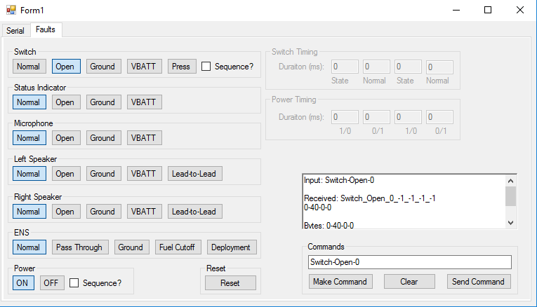

# Arduino 
---
FullBoard is an Arduino Sketch used to implement an eCall fault/state/action
simulation based on a component relay system. Each component (SOS button/switch,
Left and Right Speakers, Status Indicator, and Microphone) in the eCall stystem 
has a relay circuit system designed to simulate the eCall faults/states/actions.
These circuit diagrams can be found in their respectively labeled circuit
diagrams. Each relay in the diagram is numbered [1...N] where N <= 4.

## Requirement
A driver programn will manage the sketch through a 9600 baud rate serial
connection between the arduino and computer running the driver program. The API 
for the Sketch is defined in faultCommands.txt and the sketch ssumes all inputs 
are well formed according to this API. The drive program is responisble for
ensuring the commands are well formed as defined in faultCommands.txt. The driver 
is also responsible for ensuring that only the proper command sequences are sent 
to the sketch (a part of being well formed).

## Explaination
All components must be set up and initialized within the sketch itself. The API
does not handle the setup of the relays within the sketch. The API only sends
commands assuming everything is properly set up already. The component 
initializaiton should be known beforehand and easily setup within the sketch on
an as needed bases. 

## Arudino Test GUI
This sketch has been fully tested with "FullBoardDriver.exe", a VisualBaisc Forms
applicaiton, to demonstrate what a well-fomred command looks like and how the 
arduino communicates back to the driver program. It also shows the error checking
that is required to form a command to ensure the system works properly. 

