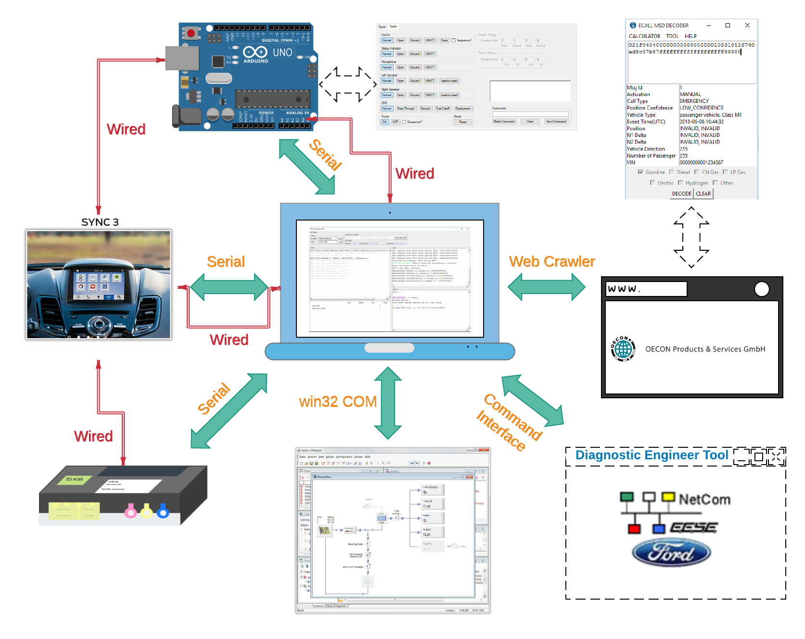

# Automation With CANalyzer
----
This project is based on Ford SYNC TDK and TCU module whose details are hidden and not covered at all, written in **Python** programming language. It's a fully automation tool on TCU module, provided with a GUI showing tests' logs and results based on user-defined scripts.

A PCB board is specially designed for this project named 'LoadBox' using **Arduino**.

The Python script can communicate with **'Loadbox'**, **Ford SYNC TDK module** through serial and **CANalyzer** through Python COM library.

## Python
Since the whole CAN DataBase is not provided, however, a simple 'python.dbc' database is provided in folder **CANalyzer config and CAPL functions**. Run 'canalyzer_test.py' to see how it works.
### Main Scripts
1. **automation_gui.py**
Main GUI thread. Users can select serial port, type in scripts and start automation.
2. **tdk.py** 
Communicate with Ford SYNC TDK module through serial.
3. **loadbox.py**
Communicate with specially designed PCB board (see also **Arduino** section) through serial.

### File
1. **script.txt**
APIs for all supported scripts.
2. **diag_list.txt**
Save diagnostic results.
3. **can_status_list.txt**
Save CAN signals from CANalyzer through COM library.

## CANalyzer config and CAPL functions
1. **test.cfg**
CANalyzer configuration used for communication with Python and calling CAPL function from Python.
2. **call_capl_function.can**
It's a CAPL script that is designed for automation test cases and it can be called from Python. 
3. **python.dbc**
A simple CAN Database. Only contains one message and one signal. 

	
## Arduino
1. **FullBoard-TimerOne.ino**
Arduino code designed for a PCB board.
2. **Board API.docx**
Board APIs that can be called from external applications.
3. **FullBoardDriver.exe**
A test GUI for Arduino board.
